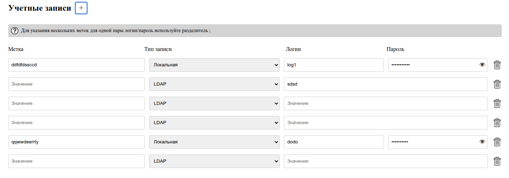

# Accounts Manager



Account management application built with Vue 3 and Composition API.

The project was developed as a frontend technical assignment focused on dynamic form management, validation, state management and data persistence.

## Task Requirements

The application allows users to create, edit and delete account records.

Each account contains:

* Labels
* Account Type
* Login
* Password

Supported account types:

* Local
* LDAP

When the LDAP type is selected, the password field is automatically hidden and stored as `null`.

## Features

### Account Management

* Add new accounts
* Edit existing accounts
* Delete accounts
* Dynamic account list

### Validation

* Required field validation
* Visual validation feedback
* Validation on blur and field updates

### Label Processing

Labels can be entered as a semicolon-separated string:

```text
work;personal;important
```

The application automatically transforms labels into a structured array:

```javascript
[
  { text: "work" },
  { text: "personal" },
  { text: "important" }
]
```

### State Management

* Centralized state management with Pinia
* Automatic data synchronization
* Persistent account storage

### Data Persistence

Account data is preserved between page reloads and restored automatically.

## Technologies

* Vue 3
* Composition API
* JavaScript
* Pinia
* Vite
* CSS3

## Technical Highlights

* Reactive state management
* Dynamic form rendering
* Conditional field visibility
* Form validation
* Local persistence
* Component-based architecture

## Installation

```bash
npm install
npm run dev
```

## Future Improvements

* TypeScript migration
* Unit tests
* Enhanced validation rules
* Search and filtering functionality


